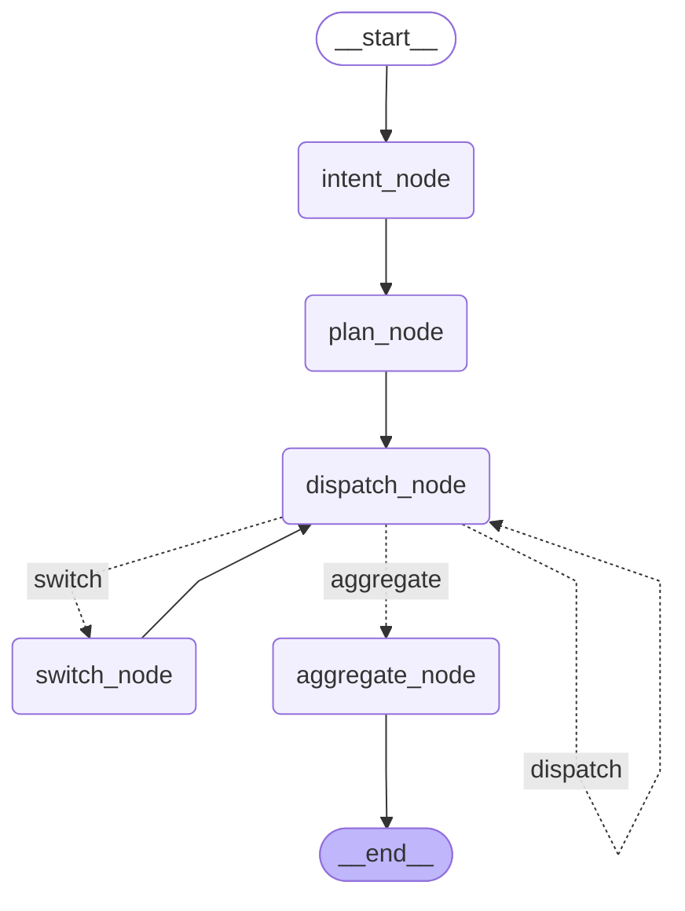

# 🤖 智能客服总控路由图

此图由 `tests/visualize_graph.py` 自动生成。

```mermaid
---
config:
  flowchart:
    curve: linear
---
graph TD;
	__start__([<p>__start__</p>]):::first
	intent_node(intent_node)
	plan_node(plan_node)
	dispatch_node(dispatch_node)
	switch_node(switch_node)
	aggregate_node(aggregate_node)
	__end__([<p>__end__</p>]):::last
	__start__ --> intent_node;
	dispatch_node -. &nbsp;aggregate&nbsp; .-> aggregate_node;
	dispatch_node -. &nbsp;switch&nbsp; .-> switch_node;
	intent_node --> plan_node;
	plan_node --> dispatch_node;
	switch_node --> dispatch_node;
	aggregate_node --> __end__;
	dispatch_node -. &nbsp;dispatch&nbsp; .-> dispatch_node;
	classDef default fill:#f2f0ff,line-height:1.2
	classDef first fill-opacity:0
	classDef last fill:#bfb6fc

```
